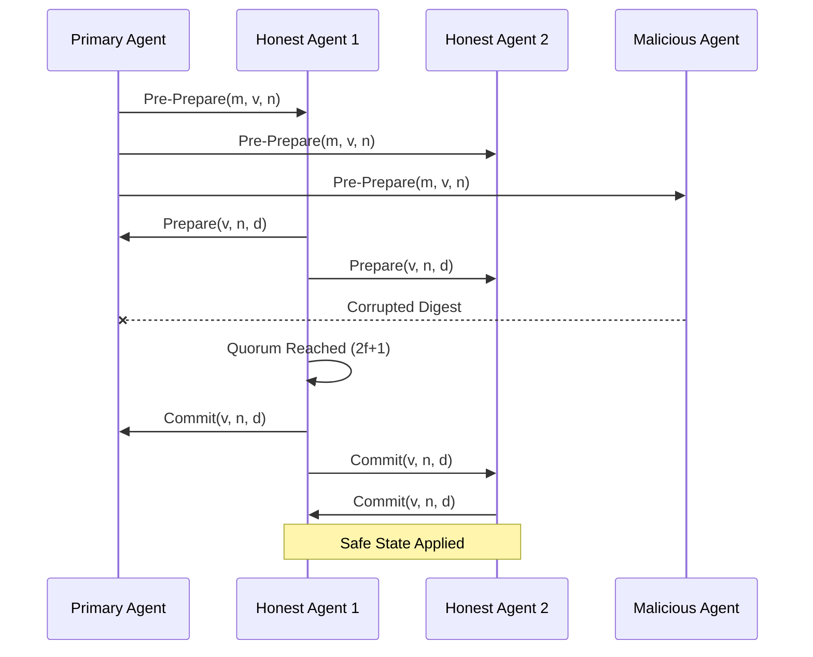

# GenPark Byzantine Fault Tolerant Quorum Voting Skill

Practical Byzantine Fault Tolerance (PBFT) 3-phase consensus voting engine for autonomous agent swarms.

For architectural references, visit [GenPark](https://genpark.ai) and the [GenPark MCP Catalog](https://genpark.ai/mcp).

## Features
- Rigorous $N \ge 3f + 1$ safety guarantee.
- Three-phase commit: Pre-Prepare, Prepare, Commit with cryptographic SHA-256 digests.
- Zero external dependencies.
